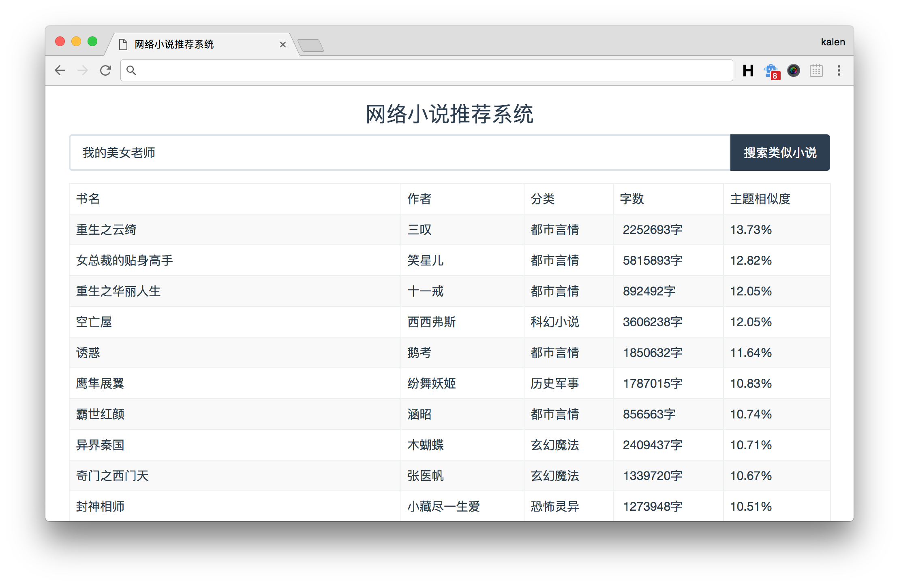

# novelRS
一个简单的网络小说推荐系统。

## 开发环境
python3.6 + mongodb

## 代码说明
### 运行小说爬虫
#### 下载小说列表：
```bash
cd crawler & python3 info_crawler.py
```
#### 下载小说的txt文件：
```bash
cd crawler & python3 txt_downloader.py
```
#### 小说过滤（只考虑大于500KB的小说）：
```bash
cd crawler & python3 download_check.py
```

### 运行推荐算法
通过ipython notebook打开RS.ipynb
```bash
cd RS & ipython3 notebook
```
然后逐步完成notebook中的以下步骤：
- 1、分词
- 2、词表分析
- 3、TF-IDF构建
- 4、KD-Tree最近邻查询
- 5、相似度更新

### 运行网页Demo
#### 导入数据
数据下载链接:https://pan.baidu.com/s/1PFjFBtaKaBeS90CL5-hIKA  密码:f16j
``` sh
mongoimport -d novelRS -c novels --file=novels.json
```

#### 前端说明
基于vue1.0编写，可以不用care。
``` sh
cd web_demo
npm install    # 安装依赖库
npm run dev    # 调试模式
npm run build  # 导出dist

```

#### 运行后台
```bash
cd web_demo & python3 main.py
```

#### 测试效果
运行后，打开[http://localhost:38438](http://localhost:38438)。


## LICENSE
MIT
